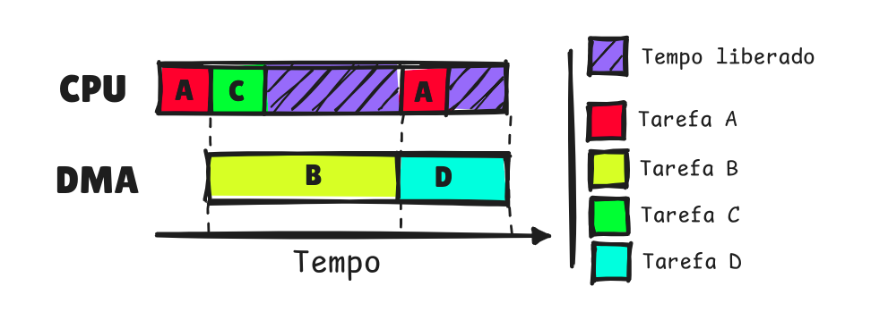

# Tutorial sobre DMA no Raspberry Pi Pico W
Este repositório tem como objetivo explicar, de forma simples e prática, como usar o DMA (Direct Memory Access) no Raspberry Pi Pico W. Sem mais enrolações, vamos lá!


# 1) O que é DMA?
O DMA (Direct Memory Access), ou Acesso Direto à Memória, no Raspberry Pi Pico W **é uma funcionalidade que permite a transferência de dados entre diferentes partes do sistema sem a intervenção direta do processador principal.**

>  Isso significa que ele pode copiar dados entre a memória e os periféricos, como GPIOs ou PWM, sem sobrecarregar a CPU, liberando-a para realizar outras tarefas.

<p align="center">
    
</p>

# 2) Habilitando o DMA
Essa interface é habilitada através da lib de baixo nível `hardware/dma.h`, nativa do Pico SDK. O DMA do Pico W possui algumas especificações:

- **Canais:** O RP2040 possui 12 canais DMA independentes, permitindo múltiplas transferências (concorrência)
    > Quando múltiplos canais estão ativos ao mesmo tempo, o DMA utiliza um esquema de round-robin (veja mais [aqui](https://embarcados.com.br/meu-kernel-minha-vida-round-robin/)) entre todos os canais que estão solicitando transferências de dados no momento. 
    Isso ocorre porque, **apesar de existirem vários canais de DMA, há um único caminho físico (barramento) que eles compartilham para realizar as transferências de dados**

- **Tamanho dos dados:**  Cada canal pode realizar uma operação de leitura e uma de escrita em cada ciclo de clock. Essas  transferências são de até 32 bits.
> Caso queira entender como ele funciona por baixo nos panos, veja [aqui](./tutorial/explorando/explorando.md).

# 3) Funções Associadas

- [Configuração de canais](./tutorial/funcoes/configuracao.md)
    > As funções de configuração permitem inicializar e definir os parâmetros necessários para as transferências DMA
- [Controle de Transferências](./tutorial/funcoes/controle.md)
    > As funções de controle permitem iniciar, parar e configurar as transferências DMA
- [Gerenciamento de Canais](./tutorial/funcoes/gerenciamento.md)
    > As funções de gerenciamento permitem reivindicar e liberar canais DMA:
- [Interrupções (IRQ)](./tutorial/funcoes/interrupcoes.md)
    >  Permitem configurar e habilitar interrupções para os canais DMA


# 4) Criando nosso projeto com DMA
A ideia desse projeto será criar um programa que leia os dados de um sensor de temperatura, transfira eles através do DMA e, apenas quando um certo número de amostras tiver sido capturadas, vamos tratá-las (exibindo elas) na `main()`.

Com todas essas tarefas, você compreenderá o funcionamento geral do DMA e poderá criar seus próprios projetos utilizando esse recurso poderoso.

### - [1) Captando os dados (ADC)](./tutorial/implementacao/1-config-adc/config.md)

### - [2) Configuração do DMA](./tutorial/implementacao/2-config-dma/config-dma.md)

> Caso queira apenas fazer o download do código-fonte deste projeto, você pode usar o site [Download GitHub directory](https://download-directory.github.io) e colocar o link abaixo (para baixar apenas a pasta onde estão os arquivos em questão):
```
https://github.com/FayrosSky/embarcatech_dma/tree/main/src
```

# Conclusão 
Neste tutorial, aprendemos a usar o DMA na captura de dados de temperatura através do ADC, abrangendo a configuração de canais e transferências. Com isso, você estará apto a desenvolver projetos eficientes e explorar as capacidades do DMA em aplicações de alto desempenho

# Referências
- [Documentation Pico SDK | hardware_dma](https://www.raspberrypi.com/documentation/pico-sdk/hardware.html#group_hardware_dma)
- [RP2040 Datasheet](https://files.seeedstudio.com/wiki/XIAO-RP2040/res/rp2040_datasheet.pdf)
- [Cornell University | Direct Memory Access computing machine
RP2040](https://people.ece.cornell.edu/land/courses/ece4760/RP2040/C_SDK_DMA_machine/DMA_machine_rp2040.html)
- [Github Rasbperry Pi | Pico Examples | DMA](https://github.com/raspberrypi/pico-examples/tree/master/dma)
- [GAC | Playing with the Pico](https://gregchadwick.co.uk/blog/playing-with-the-pico-pt2/)