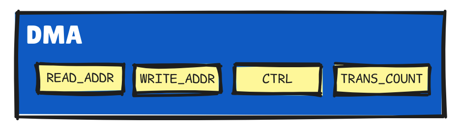

# Explorando em baixo nível

# 1) Modos de Funcionamento 
O DMA pode operar em três modos fundamentais de transferência de dados:
- **Memória para periférico (Memory-to-peripheral):** o DMA lê dados da RAM ou Flash e escreve no FIFO do periférico.    
- **Periférico para memória (Peripheral-to-memory):** o DMA lê dados do FIFO do periférico e escreve em um array na RAM.
    > É o mais comum
- **Memória para memória (Memory-to-memory):** o DMA transfere dados entre dois buffers na RAM. 

No coração do funcionamento de cada canal DMA, existem alguns locais de memória especiais, **os registradores.**  É neles que você diz ao DMA o que ele precisa fazer. São eles: 

    

- `READ_ADDR` e `WRITE_ADDR` (Leitura e Escrita)
- `CTRL` (Controle no geral)
- `TRANS_COUNT` (Controle de Transferência)

Agora vamos entender cada um deles.

### 1 READ_ADDR e WRITE_ADDR (Leitura e Escrita)
Pense neles como os "endereços" de onde o DMA vai pegar os dados e onde ele vai colocar os dados, respectivamente.
> Por exemplo, se você quer que o DMA mova dados de um pedaço da memória para um periférico, você coloca o endereço desse pedaço da memória no `READ_ADDR` e o endereço do periférico no `WRITE_ADDR`.    

### 3 CTRL (Controle)
Ele é como um painel de controle onde você configura várias opções para a transferência, como o tamanho de cada pedaço de dado (8, 16 ou 32 bits), se os endereços de leitura e escrita devem mudar automaticamente a cada transferência, e outras coisas.

Como já explicado, o CTRL é responsável por várias configurações, por isso, ele possui campos menores. Alguns exemplos são:

- `CTRL.DATA_SIZE`: Configurar o tamanho das transferências de dados deste canal (Tanto as leituras quanto as escritas do DMA usarão esse tamanho.) 
    > Pode ser configurado para 8 bits (1 byte), 16 bits (2 bytes) ou 32 bits (4 bytes).
- `CTRL.RING_SEL` e `CTRL.RING_SIZE`: Permitem configurar transferências em "anel" (Em vez de simplesmente incrementar o endereço, ele "volta" para o início após atingir um limite)
- `CTRL.TREQ_SEL`: Seleciona qual sinal de solicitação de transferência de periférico (DREQ) irá controlar as transferências deste canal.
- `CTRL.BUSY`: Indica se o canal DMA está atualmente ocupado com uma transferência.
- `CTRL.AHB_ERROR`, `CTRL.READ_ERROR`, `CTRL.WRITE_ERROR`: Indicam se ocorreram erros durante a transferência DMA

Há vários outros campos, mas já deu para perceber que essas coisas ficarão no objeto `dma_channel_config` — que geralmente é inicializado com o `dma_channel_get_default_config()`. Veja mais [aqui](../funcoes/configuracao.md#estrutura-padrão)

### 2 TRANS_COUNT (Controle de Transferência)
Esse guarda um número que diz ao DMA quantos "pedaços" de dados ele deve transferir.  **Se você quer transferir 100 bytes, por exemplo, você coloca 100 nesse registrador.** Essencialmente, ele atua como um "contador de quantos pedaços de dados ainda faltam ser transferidos"
> O tamanho de cada unidade de transferência (byte, half-word ou word) é configurado em outro registrador.

### 3 OUTROS REGISTRADORES
Há diversos outros registradores que fazem parte do DMA, mas não serão abordados aqui, pois foram citados apenas os principais. Mas aqui está outros exemplos:
- `SNIFF_CTRL` e `SNIFF_DATA`: Registradores para configurar e acessar os resultados do cálculo de checksums (CRC) pelo DMA.
- `INTEx` e `INTS`: Registradores para habilitar, desabilitar e verificar o status de interrupções do DMA. 
- `MULTI_CHAN_TRIGGER`: Usado para iniciar múltiplos canais DMA simultaneamente

# 2) Como ocorre o envio
O DMA do RP2040 usa um mecanismo DREQ baseado em crédito. Antes de entender melhor como funciona, vamos entender de forma resumida os outros métodos e porque o DREQ foi escolhido:

- **Turn on the tap ("ligar a torneira"):**  Nesse método, o DMA simplesmente envia dados para o periférico o mais rápido possível. Se o periférico não conseguir processar os dados rápido o suficiente, o FIFO do periférico pode encher e ocorrer perda de dados (overflow)

- **Handshake Simples:** Em alguns sistemas, o periférico envia um sinal para o DMA solicitando mais dados. No entanto, o DMA espera a solicitação anterior ser atendida para registrar uma nova solicitação. **Isso limita a velocidade de transferência, especialmente com FIFOs pequenos.**

## A Solução do RP2040: Credit-based DREQ
O RP2040 usa um sistema de "crédito", que reflete a disponibilidade de dados no FIFO do periférico. O periférico envia um sinal DREQ (Data Request) sempre que tem um novo dado disponível no FIFO, e o DMA usa esses créditos para decidir quando ler e transferir os dados para a RAM.

### Adicionando créditos
Cada vez que um novo dado é adicionado ao FIFO, o periférico envia um sinal DREQ ao DMA, indicando que há algo para ser lido. 

Cada DREQ incrementa o contador de crédito do canal DMA correspondente. Por exemplo, se o FIFO do ADC recebe 4 bytes, ela pode enviar até 4 DREQs, e o contador de crédito sobe para 4. 

 É como se o DMA mantivesse um registro de quantos "espaços" vagos existem no FIFO do periférico
### 1) Contador de Crédito

O DMA olha o contador de crédito. Se ele for maior que zero (ou seja, se há pelo menos um crédito), **significa que o FIFO do periférico tem pelo menos um dado pronto para ser transferido.** O DMA então solicita permissão ao sistema para ler o dado do FIFO e escrevê-lo na RAM.
> Para cada canal DMA, há um contador desses

### 2) Transferência e débito do crédito
- O DMA lê um dado do FIFO do periférico (usando o endereço em `READ_ADDR`) e o escreve no buffer da RAM (usando o endereço em `WRITE_ADDR`).
- Após a transferência, o contador de crédito é reduzido em 1, refletindo que um dado foi retirado do FIFO.
- O registrador `TRANS_COUNT` também é decrementado, acompanhando quantos dados ainda precisam ser transferidos.

> O contador de crédito tem um limite máximo, geralmente relacionado ao tamanho do FIFO do periférico. Por exemplo, a FIFO do ADC tem capacidade para 4 amostras, o número máximo de DREQs pendentes que o ADC pode gerar é 4. Portanto, o contador de crédito do DMA para o canal associado ao ADC será limitado a 4

---
### Qual diferença do TRANS_COUNT e Contador de Créditos
Esses dois termos parecem bem semelhantes, pois ambos lidam com a contagem, mas há diferenças na suas funções. A principal diferença é que o `TRANS_COUNT` **controla o número total de transferências ("quantos dados")** em uma sequência DMA, enquanto o contador de crédito **controla o ritmo ("quão rápido") dessas transferências para evitar sobrecarregar o periférico.**

---
## [Voltar](../../READme.md#3-funções-associadas)